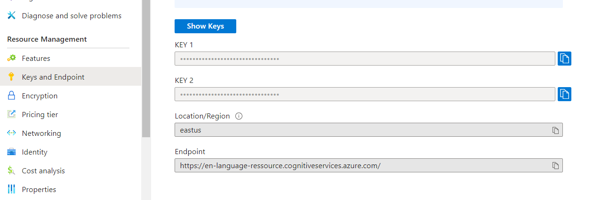
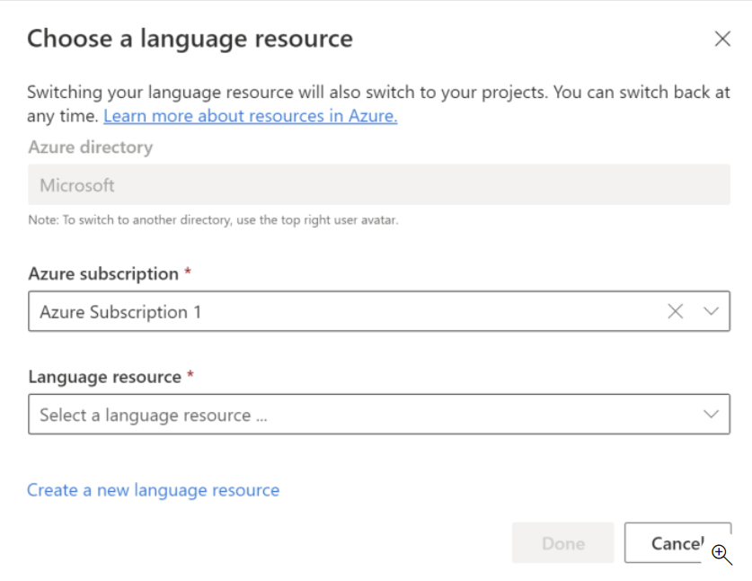
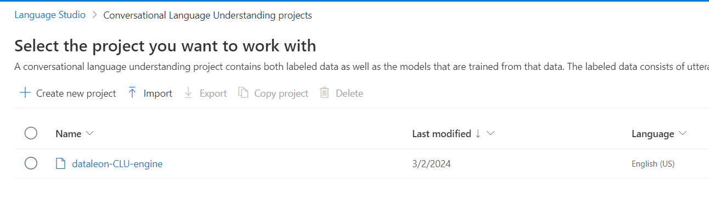
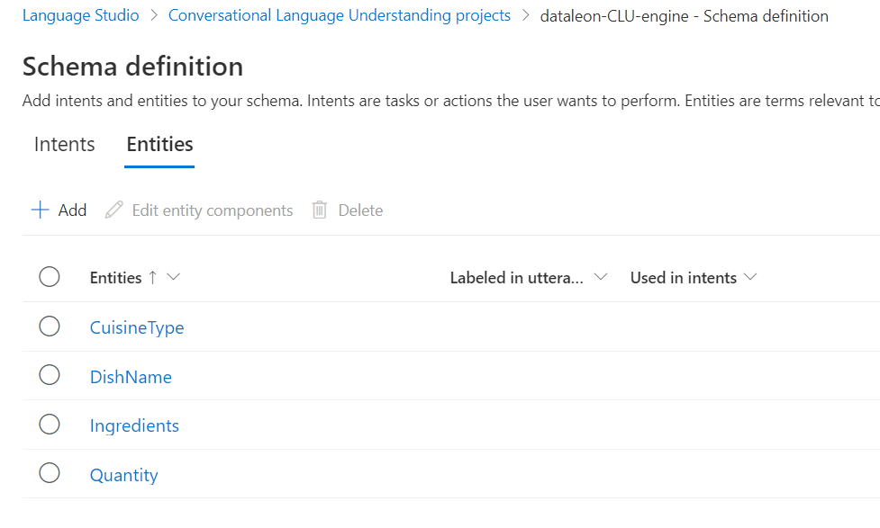

# Python Candidate testing - Elanore LELIEVRE

## Introduction

This is a program creating a Python Class CLUService that retrieve intent from Machine learning CLU (Conversational language understanding) engine. The [Language Understanding service (LUIS)](https://learn.microsoft.com/fr-fr/azure/ai-services/luis/what-is-luis) will be decommissioned on October 1, 2025, and from April 1, 2023, we are no longer able to create new LUIS resources. That's why I've chosen to use [Conversational Language Understanding (CLU)](https://learn.microsoft.com/en-gb/azure/ai-services/language-service/conversational-language-understanding/quickstart?pivots=language-studio) to replace the LUIS. We write write some Python test with pytest about different intents and entities from recipe cooking.

## Installation 

- Azure Conversational Language Understanding client library 
Use the package manager [pip](https://pip.pypa.io/en/stable/) to install the [Azure Conversations client](https://learn.microsoft.com/en-us/python/api/overview/azure/ai-language-conversations-readme?view=azure-python&viewFallbackFrom=azure-python-preview&preserve-view=true) library for Python : 

```bash
pip install azure-ai-language-conversations
```

- Pytest library 
Use the package manager [pip](https://pip.pypa.io/en/stable/) to install [pytest](https://docs.pytest.org/en/8.0.x/) library for writing test : 

```bash
pip install azure-ai-language-conversations
```

OR

- Install requirements.txt file :

```bash
pip install -r requirements.txt 
```

## Usage

- Clone this repository, from your local machine :

```bash
git clone https://github.com/Elanore1/dataleon-back-end.git
```
 
-   Run tests : 

```bash
pytest test_clu_service.py
```

### Create Language Ressource

1. Go to [Azure](https://portal.azure.com/) and sign-in 

2. Create a new Language service ressource in [Azure AI services](https://portal.azure.com/#view/Microsoft_Azure_ProjectOxford/CognitiveServicesHub/~/TextAnalytics)

3. Save your language ressource 'Keys' and 'Endpoint'



### Create a Conversational language understanding project

1. Go to [Language Studio](https://language.cognitive.azure.com/) and choose the language ressourceyou just created.



2. Create a new 'Conversational language understanding' project. Save the project name, it will appeard in your projects. 



3. Add Intent and Entities from recipe cooking 



4. Train a new model and deploy it. Save your 'deploymentName'. After that you can test your deployed models.

### CluService class 

It is a class that retrieve intent from the Machine Learning CLU engine. We initialize the client by giving the 'endpoint' and 'key' of our language ressource.

```py
    def __init__(self, endpoint, subscription_key):
        self.endpoint = endpoint
        self.credential = AzureKeyCredential(subscription_key)
        self.client = ConversationAnalysisClient(self.endpoint, self.credential)
```

In the get_intent() method from [clu_service.py](clu_service.py), specified in 'task' the name of your CLU project and the name of your deployement.

```py
    "parameters": {
        "projectName": "Your-Project-Name", #CLU project name
        "deploymentName": "Your-Deployement-Name", #CLU deployement name
        "verbose": True
    }
```

### Pytest for testing Recipe Intent and Entities

You can test if the utterance fit well with your Recipe Intent and Entities.

## Authors

- [Elanore LELIEVRE](https://www.linkedin.com/in/elanore-lelievre/)
